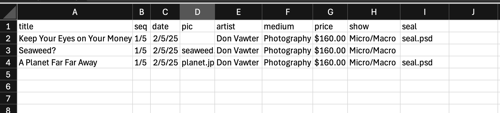
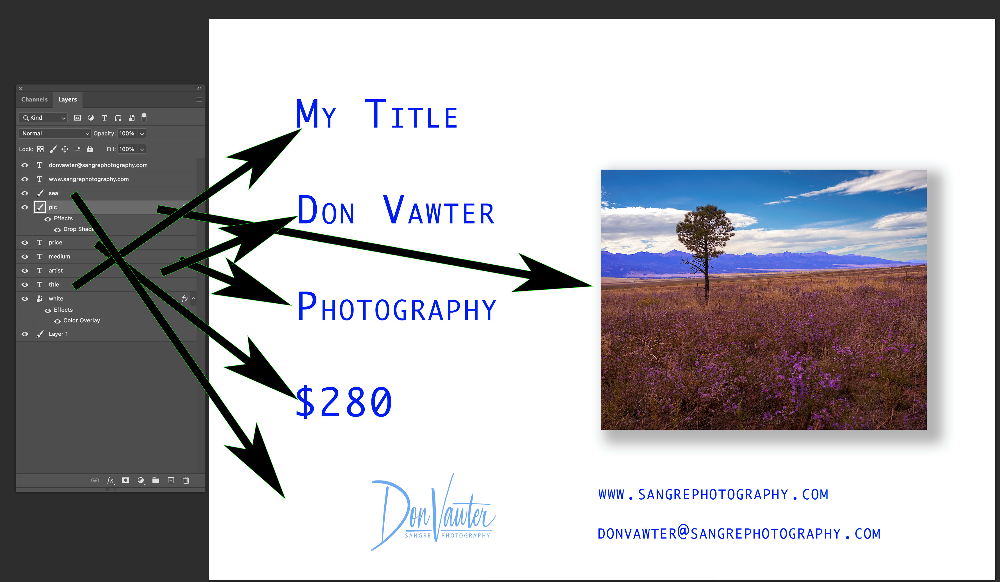
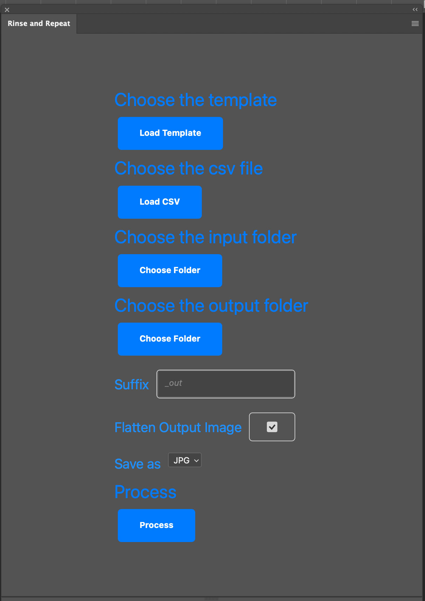
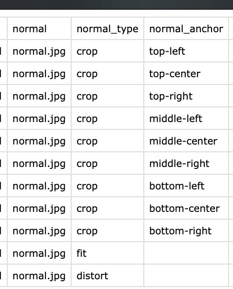

# Rinse and Repeat
Photoshop plugin to replace images and text fields with data from a csv file

## Features
* Images can be cropped, fit, or distorted
* Anchor points can be set for cropped images
* Masks, Layer effects, and Clipping masks are retained
* Empty text are replaced with ""
* If an image field is empty, the visibility of the template image is set to false
* Replacement is triggered by the name of a header in the csv file equaling a layer name.
* Columns not matching layer names are ignored
* Output files may be png, jpg, or psd
* pdf files can be optionally flattened

## Installation
  The ccx file is available in the Adobe Creative Cloud Market Place. It is free.

## CSV File Example
  
The column names correspond to the layer names in the template. All image files are expected to be in the "input folder". You will notice that for some rows the "pic" and "seal" columns are empty. Those are image columns. When the entry is blank, the visibility of the placeholder image in the template is set to false. By default images will be scaled to "fit" in the space occupied by the placeholder image in the template. This means that if the aspect ratio of the new and place holder images differ there will be a gap where the underlying layer will show through. You do not need anything in the csv file to specify the default behavior. Additions to the file for non default behavior will be discussed later.

## Mapping the template to the CSV file

Notice that the layer names correspond to columns in the CSV file. Those relations are case sensitive and cannot include extra spaces or characters. You should also be careful when naming text layers. Photoshop will often rename the layer if you change the text. When we make the substitution we make sure to retain the original layer name. Notice there are many layers in the template without corresponding columns in the csv file. These layers will remain as they were in the original template.

## Invoking the template
To invoke the plugin, go to the Plugins Menu and find "Rinse and Repeat" This will bring up a dialog as follows:

Just follow the steps from top to bottom:
1. Choose the template psd file
2. Choose the data (csv) file
3. Choose the input folder (the location of your image files)
4. Choose where to store the generated images
5. Choose a suffix to append to the file name. By default, the program looks for a column named "filename". If that is not found, then the contents of the first column in the csv file is used. Therefor be careful that you use a unique value in either filename or the first column. Otherwise, images will get overwritten.
6. Choose whether to flatten the output file. This is only relevant for psd files.
7. Choose the output format. Choices are psd, jpg, or png.
8. Choose Process to kick off plugin.

## Handling Complex image manipulation
By default the image placed where the template placeholder image was, will be scaled so the entire image will be visible. Of course, its aspect ratio will be preserved. This means that if it has a different aspect ratio than the placeholder, there will be gaps on either the top and bottom or left and right. If you want a different behavior, there are two options:
1. Distort the image to fill the gaps
2. Fill the gaps and then crop the excess.
If you choose #2 then you must choose where to anchor the crop. This is similar to what you do when resizing the canvas in photoshop.
You must add two additional columns in the csv file to specify this behavior. If the original image column is "foo" then you add two columns "foo_type" and "foo_anchor". In the image below, the original image column is "normal".

The allowable values for type are crop, distort, fit and blank. Fit and blank mean the same thing and designate default behavior.
The allowable values for anchor are shown. They are only relevant for crop. There is not concept of anchor point for fit and distort because the entire image is shown.
Once again, you only need to add these columns if the normal default behavior of fitting the entire image does not meet your needs.

